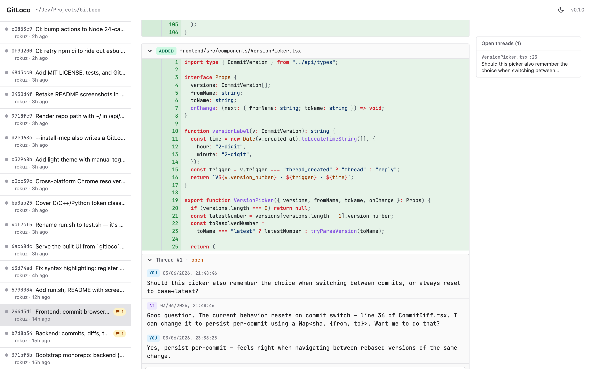
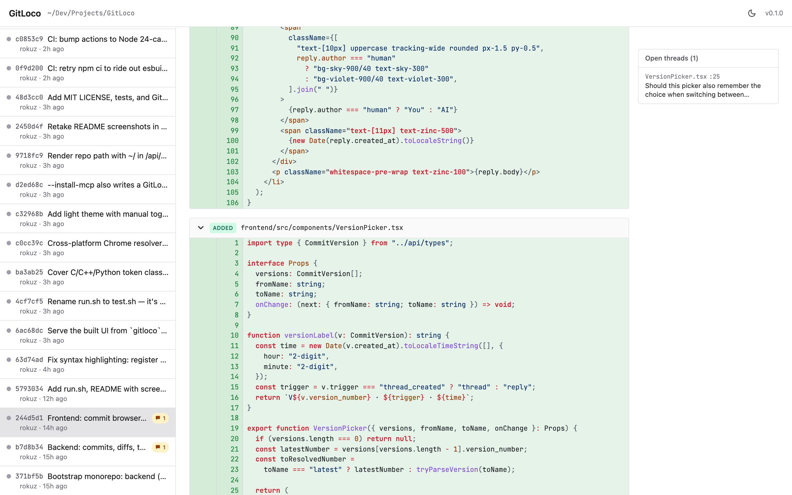
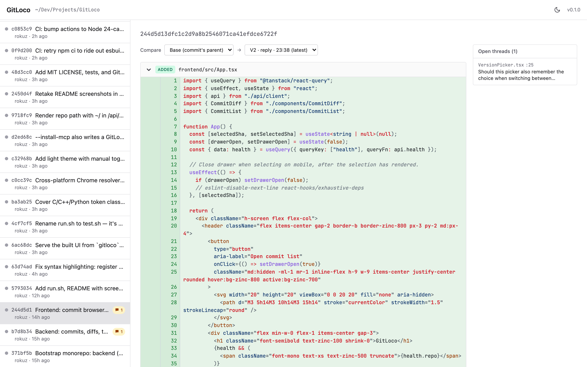
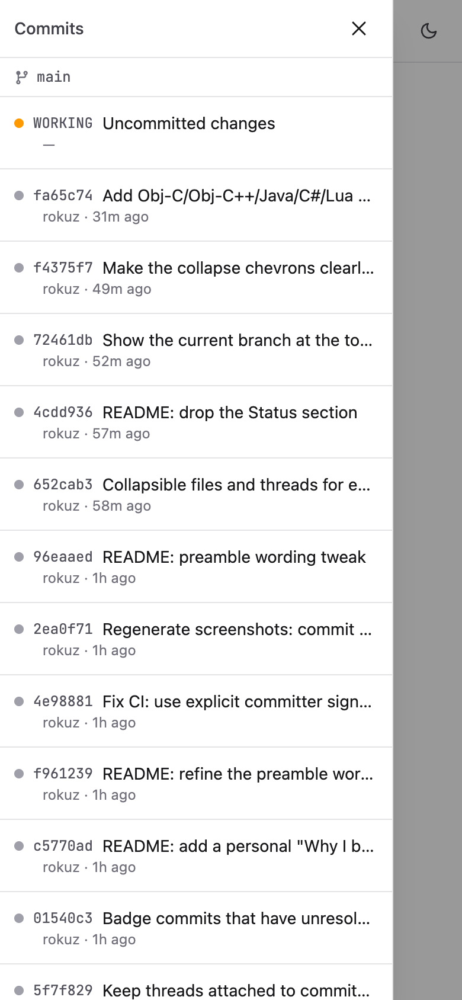
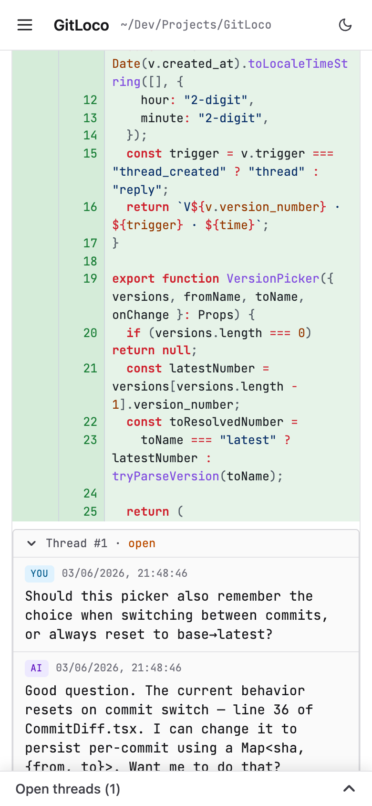

# GitLoco

[](https://github.com/rokuz/gitloco/actions/workflows/ci.yml) [](LICENSE)

Local code-review tool for AI-generated git changes. A human leaves comments on diff lines through a browser UI; an AI agent (Claude) reads them, replies, and amends the original commits via rebase. Threads survive the rebase because GitLoco snapshots both sides of the diff at comment time.



## Why I built this

I, like many others, work with AI to write code. And when the machine writes most of the code in your name, careful self-review is more important than ever. For me, how code *looks* matters: naming, shape, the small decisions on each line. I want fine-grained control over the lines an AI agent generates.

The problem is the channel. I kept struggling to explain, in an AI agent's command line, how I want a piece of code to look and work — describing a line in prose is clumsy when I could just *point at it*. So I wanted a local tool that sits between me and the AI agent, with comment threads where I can say exactly what to do with any single line of generated code. The agent reads those comments, fixes the lines, and replies.

This is how GitLoco appeared. "Loco" comes from **local** — it runs entirely on your machine, just you and the agent. But I like the play of words too: *loco*motive. As Sheldon Cooper said, everyone loves trains. 🚂

## What it does

- Runs as a one-process-per-repo local server (like `jupyter`, `storybook`).
- Shows the repo's commit history + working-tree changes in a unified diff view with syntax highlighting.
- Lets you anchor comment threads to specific lines of specific commits.
- Exposes those threads to AI agents via REST **and** an MCP server in the same process.
- Captures **all** files touched by a commit on every human action so the agent has full multi-file context.
- LAN-accessible — open the same URL from your phone on the couch.
- Single-user local. No auth, no multi-tenancy.

## Prerequisites

- **[uv](https://docs.astral.sh/uv/)** — the Python package manager GitLoco is built and installed with. Install it with `curl -LsSf https://astral.sh/uv/install.sh | sh` (macOS/Linux) or `brew install uv`. uv manages the Python toolchain itself, so you don't need a separate Python install.
- **Node.js 20+ / npm** — to build the frontend bundle (`./build.sh`).
- **git** — GitLoco reviews git repositories.

## Install

```bash
# Clone, then build + install the CLI in one step.
git clone <repo> gitloco
cd gitloco
./build.sh
```

`build.sh` builds the frontend, bundles it into the backend package, and runs `uv tool install .` — putting a `gitloco` binary on your `$PATH` (typically `~/.local/bin/gitloco`). It fails fast if `uv` isn't installed. Re-run it any time to rebuild and reinstall.

## Use

From any git repository:

```bash
cd /path/to/your/repo
gitloco                       # serves UI + API on http://localhost:7777, opens browser
```

To wire Claude Code into the running server (so the `/gitloco` slash command and the `gitloco` MCP tools appear), run once per repo you want to review:

```bash
cd /path/to/your/repo
gitloco --install-mcp         # writes .mcp.json + .claude/commands/gitloco.md
```

On first launch macOS may prompt to allow the Python process to accept incoming connections. Click **Allow** and the LAN URL (printed on startup) becomes reachable from your phone on the same Wi‑Fi.

## Develop GitLoco itself

The `./test.sh` script starts the backend and Vite together, against GitLoco's own repo by default:

```bash
( cd backend  && uv sync )
( cd frontend && npm install )
./test.sh                      # opens http://localhost:5173 (Vite, proxies /api to backend)
```

`./test.sh` is purely a development convenience. End users have the installed `gitloco` command, which serves the same UI + API from a single port without Vite.

## Screenshots

### Commit list + diff overview


### Diff view with syntax highlighting



### Version compare — switch and compare snapshots of a commit over time

Every human action (new thread or human reply) captures the full file set as a new version. The picker defaults to **Base → Latest**.



### Mobile

The sidebar becomes a slide-over drawer below the `md` breakpoint, so the same UI works from a phone over LAN. Threads embed inline on the diff there too — you can carry on a review conversation from your phone.

<p>
  
  
</p>

## Stack

- **Backend:** Python 3.12, FastAPI, pygit2, SQLModel + SQLite, official `mcp` SDK (streamable‑HTTP transport mounted in‑process at `/mcp/`).
- **Frontend:** Vite + React 19 + TypeScript, Tailwind v4, TanStack Query, `react-diff-view`, refractor (Prism) for syntax highlighting.
- **Storage:** `.gitloco/comments.db` inside the reviewed repo (auto‑gitignored).

## CLI

```
gitloco [PATH] [OPTIONS]

  --host TEXT             Bind address (default 0.0.0.0; use 127.0.0.1 to
                          disable LAN access)
  --port INT              Port (default 7777)
  --no-browser            Do not open a browser on launch
  --install-command       Write .claude/commands/gitloco.md and exit
  --install-mcp           Write/update .mcp.json so Claude Code discovers
                          the local GitLoco MCP server (implies
                          --install-command)
  --force                 Overwrite an existing slash-command file
```

## MCP tools exposed to the agent

- `list_open_threads(commit_sha?)` — threads to address, ordered oldest commit first
- `get_thread(thread_id)` — full context: replies, primary file snapshots, `all_files` for the whole commit, `history_since`, `working_tree_patch`, `current_content`, `latest_version_number`
- `reply_to_thread(thread_id, body)`
- `list_commit_versions(commit_sha)` / `get_commit_version(commit_sha, n)`
- `get_file_history(file_path, since_commit_sha?)` / `get_file_at(commit_sha, file_path)`
- `get_commit_diff(commit_sha)` / `list_commits_tool()`

There is intentionally no `resolve_thread` tool. Humans resolve via the UI.
